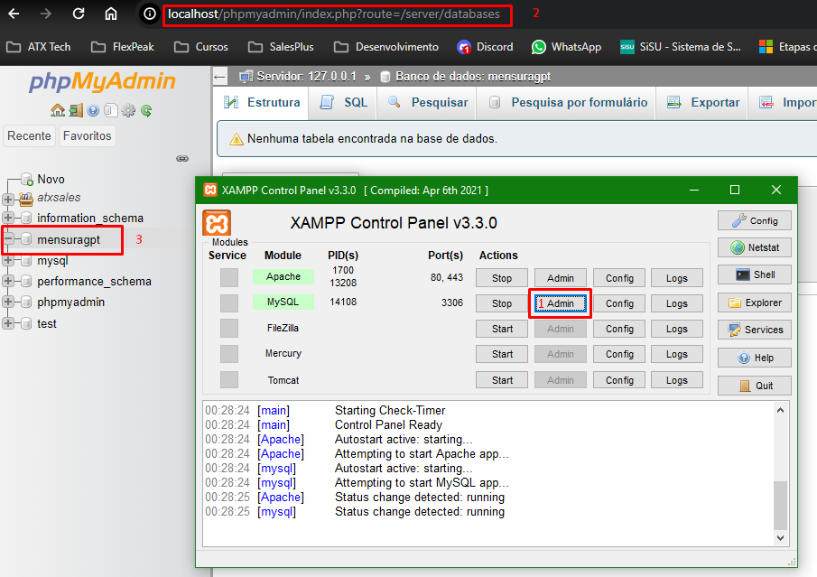

## Projeto PAIC IFAM CMDI

## 1 - Prepare seu ambiente para que possa rodar o projeto.

<li>PHP 7.4: A linguagem de programação principal utilizada no desenvolvimento.</li>

<li>MySQL 5.7: Sistema de gerenciamento de banco de dados relacional.</li>

<li>Bootstrap: Framework de design web para criar interfaces responsivas e atraentes.</li>

<li>HTML5, CSS3: Padrões modernos para estruturação e estilização de páginas web.</li>

<li>JavaScript e jQuery: Tecnologias essenciais para interatividade e manipulação do lado do cliente.</li>

<li> Instale o XAMPP desse link pois já vem com todos os componentes necessários para rodar o projeto (https://sourceforge.net/projects/xampp/files/XAMPP%20Windows/7.4.33/) </li>

## Tecnologias Utilizadas
<ul>
<li>Laravel 10: O framework PHP moderno e robusto que proporciona uma estrutura elegante para o desenvolvimento de aplicativos web.</li>

<li>Yajra DataTables: Utilizado para gerenciar e exibir tabelas de forma interativa.</li>

<li>AdminLTE 3: Um painel administrativo construído sobre o framework Bootstrap, fornecendo uma interface de usuário moderna e responsiva.</li>
</ul>

## Instruções de Instalação

Crie o banco de dados com nome: mensuragpt usando o phpmyadmin do xampp

Usando o CMD do Windows clone o repositório:  git clone https://github.com/aureliomuzzi/mensuragpt.git dentro do diretório C:\xampp\htdocs

Usando o CMD do Windows entre na pasta do projeto clonado: mensuragpt 

Copie o arquivo .env.example para .env e configure o banco de dados e outras configurações necessárias.

Instale as Dependências:  composer install

## Execute as Migrações e Seeders:

php artisan migrate --seed

## Inicie o Servidor:

php artisan serve

## Acesse o sistema no navegador em http://localhost:8000.
